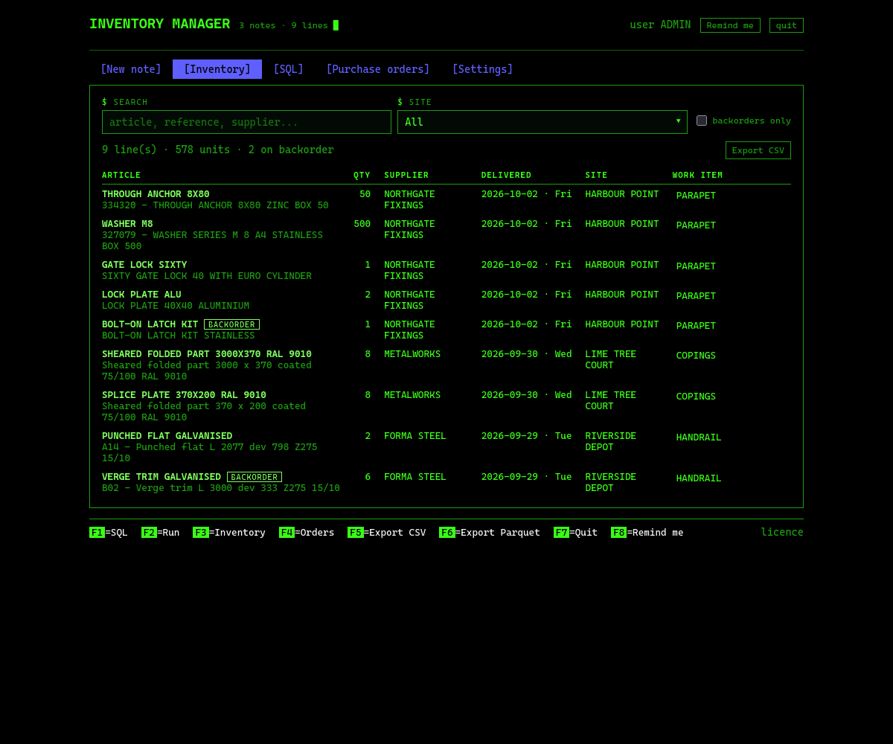
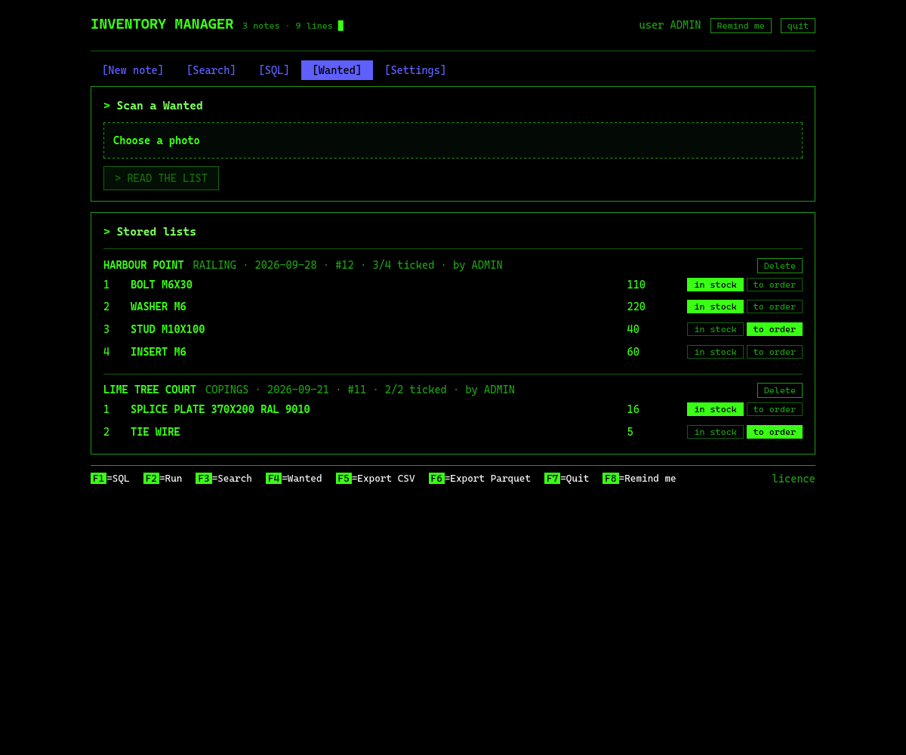
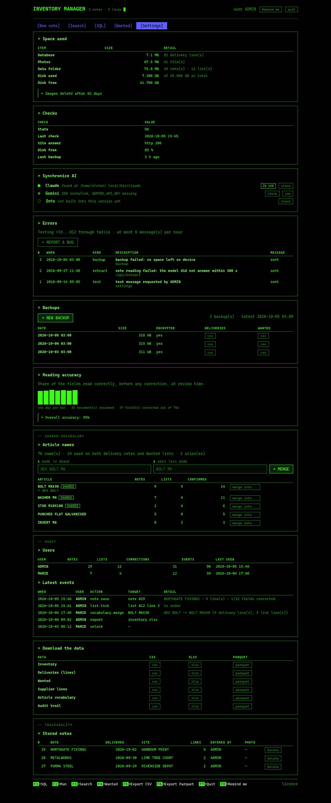

# Stock manager

A software ERP for Inventory management. Photograph each Delivery note you receive and it is transcripted ,by duckdb, to a database*. You can then check the data under "Inventory", sort it, export it or query it with SQL.
Same for Purchase orders. The goal is to report a company's inventory without having to manually audit it. The two bottlenecks will narrow down stocks: hardware input and outputs. 
Custom built to answer a real company's needs on inventory tracking. 

each article stored in [inventory] database has its own line with indicators such as : name, quantity, supplier name, delivery date, order date, order reference and additional information.

for those stored in [Purchase order] "in stock" or "to order" clickable option are available: You can then export them as, regardless of the purchase order #, to bulk order them. 


*computer vision is used, you must synchronize your AI model for recognition. More models compatibility to come.






## Install

Python 3.11

```bash
pipx install git+https://github.com/Louis31921c/Inventory-Manager.git#subdirectory=stock-manager
```


Once in, plug your model ;

Computer vision is used, you must synchronize your AI model for recognition. As of now, two models are compatible. More models to come.

- **Claude Code CLI** (default): install it, run `claude` once and `/login`. No API key.
- **Gemini API**: `pip install "stock-manager[gemini]"`, then put `LLM_BACKEND=gemini` and
  `GEMINI_API_KEY=...` in the settings file.

Except snapping photos, Everything else works with no model at all.

## The password

The first time the window opens it asks for a name and a password. After that the
app is locked on every start for quick acess: the right password opens your data. You still can disconnect after each session but five wrong tries pause it for five minutes.

the session expires on its own after 12 hours.

## What protects the data

| Guard | What it stops |
|---|---|
| Loopback only, random port | nothing on the network can reach it |
| Password on open, scrypt hash, five tries per five minutes | someone sitting down at your machine |
| Signed session cookie, `SameSite=strict`, twelve hours | another site reusing your session |
| Origin check on every write | a page in your browser posting to the app |
| Read-only SQL, filesystem access off, one statement | a question turning into a delete |
| `0600` on the database, settings and account file, `0700` on the data folder | other accounts on the machine |
| 30 MB cap on uploads, photos purged after six weeks | the disk filling up quietly |
| Encrypted snapshots when `BACKUP_PASSPHRASE` is set | a stolen backup |

For a laptop that leaves the workshop, turn on full disk encryption.

### The five tabs

Press `1` to `5` to navigate between tables.

| Tab | What you do |
|---|---|
| New note | `R` snaps a photo. Correct the fields and lines, then save. |
| Search | `/` filters, `B` shows backorders only, `E` edits the work item of a line. |
| SQL | `Enter` query it yourself. You can export it as csv, parquet or xslx for more options. |
| Purchase orders | `R` reads a sheet. `S` in stock, `O` to order, `C` clears, `D` deletes. |
| Settings | `B` backup, `T` test message, `M` merge two names, `E` export, `P` purge photos. |

### Keys everywhere

| Key | Does |
|---|---|
| F1 | SQL tab |
| F2 | ask a question |
| F3 | search |
| F4 | purchase orders |
| F5 / F6 | export |
| F7 | quit |
| Ctrl-U | clear the line you are typing |
| Esc | cancel |


## Where things are stored

| What | Path |
|---|---|
| Database and photos | `~/.local/share/stock-manager/` |
| Settings | `~/.config/stock-manager/settings.env` |
| Exports | `~/.local/share/stock-manager/exports/` |
| Backups | `~/.local/share/stock-manager/backups/` |

Override the data folder with `--data /some/path` or `DATA_DIR`. Copy `.env.example` to the
settings file to see every key.



## what it does that a spreadsheet does not

Article name memory : if you corrected/ tweaked a input after snapping a photo, the algortihm remembers it and wont (at least very not likely) do the same mistake twice : 

Audit trail : Every save, correction, tick, merge, backup and export is written down with the
user name, which is your login name.

**Errors that reach you.** Any failure is referenced with a "#", a row in the database and, with
`SMS_PROVIDER` set, a text message: `Stock manager error #14: backup failed - no space left on
device` to the Admin. Repeats are muted.


## Settings

- space used gives an indicator on what is used and the space left : snapshots are deleted after 6 weeks not to skyrocket your cloud/disk usage
- checks on last backup, functionement state and its last check, and more...
- synchronize AI to pick your Model. can be plugged to Open AI dots for reordering automation. More models/ suppliers to come.
- Errors where tickets are directly sent to a phone number. you can see the lastest tickets sent
- backups
- Model accuracy, or how many time on average have you corrected what the model input after snapping a note
- activity audit, where you can openly track each users activity on the software. can be hidden, for admin only, as a json file.
- export/ download each tables, under different formats
- stored notes tracking


## Files roles

| File | Role |
|---|---|
| `inventory/tui.py` | the full screen program: screens, keys, curses loop |
| `inventory/cli.py` | the commands |
| `inventory/screen.py` | the character grid both the terminal and the screenshots draw into |
| `inventory/db.py` | DuckDB storage and exports |
| `inventory/llm.py` | the two model backends |
| `inventory/vocabulary.py` | shared article names, aliases, merges |
| `inventory/audit.py`, `alerts.py` | who did what, and what broke |

## Contributions / Updates
- built in indicators
- encryption, safe share, global security
- more compatibility to different tools, models...
- storage space optimization
- overall growth
## Licence

MIT: see [LICENSE](LICENSE). Copyright @louis31921c.

What comes back from a photo is a draft. Models misread quantities, references and dates, which is
why the correction step exists. This is not a system of record.
